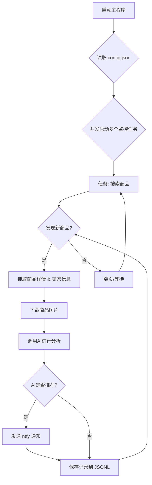

# 闲鱼智能监控机器人 (Xianyu-Monitor-Robot)

一个基于 Playwright 和 OpenAI 的闲鱼多任务实时监控与智能分析工具。

## ✨ 项目亮点

- **多任务并发**: 通过 `config.json` 同时监控多个关键词，互不干扰。
- **实时流式处理**: 发现新商品后，立即进入分析流程，告别批处理延迟。
- **深度AI分析**: 集成多模态大语言模型（如 GPT-4o），结合商品图文和卖家画像进行深度分析，精准筛选。
- **高度可定制**: 每个监控任务均可配置独立的关键词、价格范围、筛选条件和AI分析指令 (Prompt)。
- **即时通知**: 通过 [ntfy.sh](https://ntfy.sh/) 将符合AI推荐的商品立即推送到你的手机或桌面。
- **健壮的反爬策略**: 模拟真人操作，包含多种随机延迟和用户行为，提高稳定性。

## 🚀 工作流程



## 🛠️ 技术栈

- **核心框架**: Playwright (异步) + asyncio
- **AI 模型**: OpenAI API (支持 GPT-4o 等多模态模型)
- **通知服务**: ntfy
- **配置管理**: JSON
- **依赖管理**: pip

## 📂 项目结构

```
.
├── .env                # 环境变量，存放API密钥等敏感信息
├── .gitignore          # Git忽略配置
├── config.json         # 核心配置文件，用于定义所有监控任务
├── login.py            # 首次运行必须执行，用于获取并保存登录Cookie
├── spider_v2.py        # 主程序：集成了爬取、分析、通知的完整逻辑
├── requirements.txt    # Python依赖库
├── README.md           # 就是你正在看的这个文件
├── prompts/            # 存放不同任务的AI分析指令(Prompt)
│   └── macbook_prompt.txt
├── images/             # (自动创建) 存放下载的商品图片
└── *.jsonl             # (自动创建) 存放每个任务的抓取和分析结果
```

## ⚙️ 使用指南

### 1. 环境准备

克隆本项目到本地:
```bash
git clone https://github.com/USERNAME/REPONAME.git
cd REPONAME
```

安装所需的Python依赖：
```bash
pip install -r requirements.txt
```

### 2. 配置环境变量

在项目根目录创建一个 `.env` 文件，并填入以下配置信息。
```env
# OpenAI API 相关配置
OPENAI_API_KEY="sk-..."
OPENAI_BASE_URL="https://api.openai.com/v1"  # 如果使用代理，请修改为代理地址
OPENAI_MODEL_NAME="gpt-4o"

# ntfy 通知服务配置
NTFY_TOPIC_URL="https://ntfy.sh/your-topic-name" # 替换为你的 ntfy 主题 URL
```

### 3. 获取登录状态 (重要)

为了让爬虫能够以登录状态访问闲鱼，**必须先运行一次登录脚本**以生成会话状态文件。
```bash
python login.py
```
运行后会弹出一个浏览器窗口，请使用**手机闲鱼App扫描二维码**完成登录。成功后，程序会自动关闭，并在项目根目录生成一个 `xianyu_state.json` 文件。

### 4. 配置监控任务

打开 `config.json` 文件，根据你的需求添加或修改监控任务。你可以定义多个任务，并通过 `"enabled": true/false` 来控制其是否在下次运行时启动。

每个任务都可以关联一个位于 `prompts/` 目录下的AI分析指令文件。你可以参考 `prompts/macbook_prompt.txt` 创建自己的指令。

### 5. 启动监控！

一切就绪后，运行主脚本 `spider_v2.py` 即可启动所有已启用的监控任务。
```bash
python spider_v2.py
```
程序会开始并发执行任务，并实时打印日志。当有符合AI推荐条件的商品出现时，你会立即收到ntfy通知。

**调试模式**: 如果只想测试少量商品，可以使用 `--debug-limit` 参数。
```bash
# 每个任务只处理前2个新发现的商品
python spider_v2.py --debug-limit 2
```

## ⚠️ 注意事项

- 请遵守闲鱼的用户协议和robots.txt规则，不要进行过于频繁的请求，以免对服务器造成负担或导致账号被限制。
- 本项目仅供学习和技术研究使用，请勿用于非法用途。
