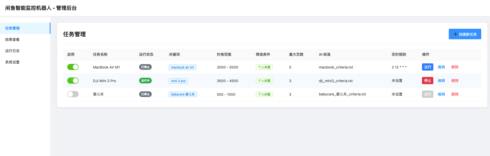
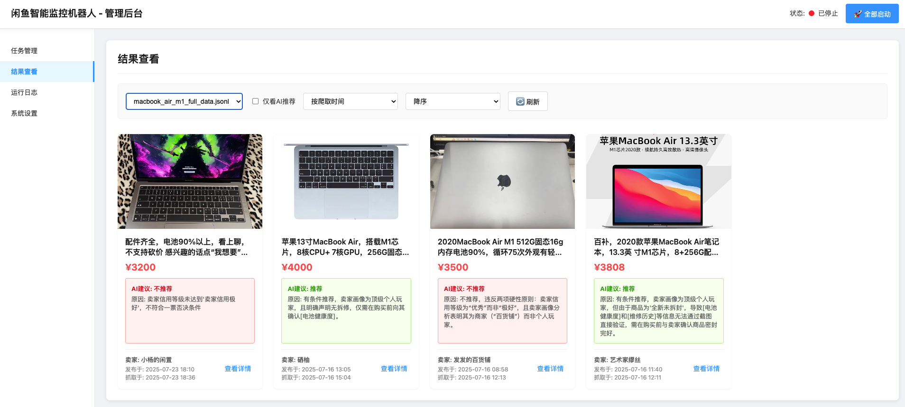
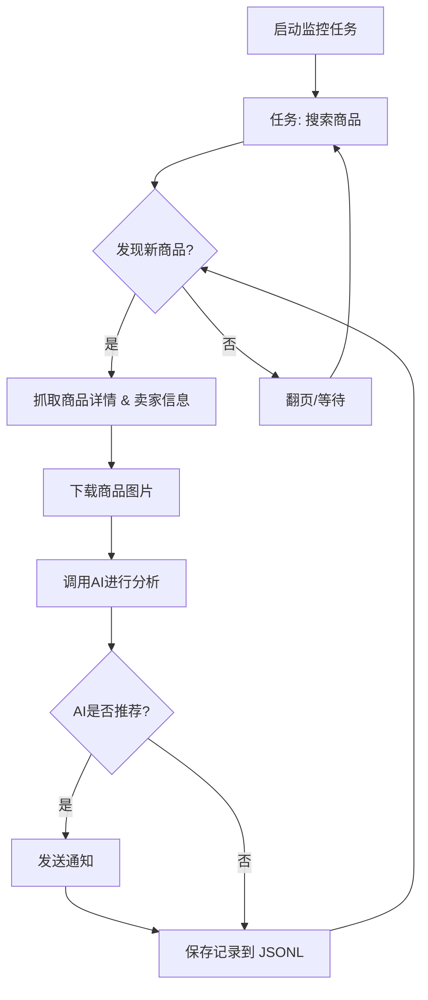

# 闲鱼智能监控机器人

一个基于 Playwright 和AI过滤分析的闲鱼多任务实时监控与智能分析工具，配备了功能完善的 Web 管理界面。

## ✨ 项目亮点

- **可视化Web界面**: 提供完整的Web UI，支持任务的可视化管理、AI标准在线编辑、运行日志实时查看和结果筛选浏览，无需直接操作命令行和配置文件。
- **AI驱动的任务创建**: 只需用自然语言描述你的购买需求，即可一键创建包含复杂筛选逻辑的全新监控任务。
- **多任务并发**: 通过 `config.json` 同时监控多个关键词，各任务独立运行，互不干扰。
- **实时流式处理**: 发现新商品后，立即进入分析流程，告别批处理延迟。
- **深度AI分析**: 集成多模态大语言模型（如 GPT-4o），结合商品图文和卖家画像进行深度分析，精准筛选。
- **高度可定制**: 每个监控任务均可配置独立的关键词、价格范围、筛选条件和AI分析指令 (Prompt)。
- **即时通知**: 支持通过 [ntfy.sh](https://ntfy.sh/)、企业微信机器人和 [Bark](https://bark.day.app/)，将符合AI推荐的商品立即推送到你的手机或桌面。
- **定时任务调度**: 支持 Cron 表达式，可为每个任务设置独立的定时执行计划。
- **Docker 一键部署**: 提供 `docker-compose` 配置，实现快速、标准化的容器化部署。
- **健壮的反爬策略**: 模拟真人操作，包含多种随机延迟和用户行为，提高稳定性。

## 页面截图

**后台任务管理**


**后台监控截图**


**ntf通知截图**


## 🚀 快速开始 (Web UI 推荐)

推荐使用 Web 管理界面来操作本项目，体验最佳。

### 第 1 步: 环境准备

> ⚠️ **Python版本要求**: 本地部署调试时建议使用 Python 3.10 或更高版本。较低版本的Python可能会导致依赖包安装失败或运行时错误（如 `ModuleNotFoundError: No module named 'PIL'`）。

克隆本项目到本地:

```bash
git clone https://github.com/dingyufei615/ai-goofish-monitor
cd ai-goofish-monitor
```

安装所需的Python依赖：

```bash
pip install -r requirements.txt
```

### 第 2 步: 基础配置

1. **配置环境变量**: 复制`.env.example`文件并命名为`.env`，并修改里面的内容。  

    Windows使用命令行：

    ```cmd
    copy .env.example .env
    ```

    Linux/MacOS使用命令行：

    ```shell
    cp .env.example .env
    ```

    `.env` 文件中的所有可用配置项如下：

    | 环境变量 | 说明 | 是否必填 | 注意事项 |
    | :--- | :--- | :--- | :--- |
    | `OPENAI_API_KEY` | 你的AI模型服务商提供的API Key。 | 是 | 对于某些本地或特定代理的服务，此项可能为可选。 |
    | `OPENAI_BASE_URL` | AI模型的API接口地址，必须兼容OpenAI格式。 | 是 | 请填写API的基础路径，例如 `https://ark.cn-beijing.volces.com/api/v3/`。 |
    | `OPENAI_MODEL_NAME` | 你要使用的具体模型名称。 | 是 | **必须**选择一个支持图片分析的多模态模型，如 `doubao-seed-1-6-250615`, `gemini-2.5-pro` 等。 |
    | `PROXY_URL` | (可选) 需要翻墙时配置的HTTP/S代理。 | 否 | 支持 `http://` 和 `socks5://` 格式。例如 `http://127.0.0.1:7890`。 |
    | `NTFY_TOPIC_URL` | (可选) [ntfy.sh](https://ntfy.sh/) 的主题URL，用于发送通知。 | 否 | 如果留空，将不会发送 ntfy 通知。 |
    | `GOTIFY_URL` | (可选) Gotify 服务地址。 | 否 | 例如 `https://push.example.de`。 |
    | `GOTIFY_TOKEN` | (可选) Gotify 应用的 Token。 | 否 | |
    | `BARK_URL` | (可选) [Bark](https://bark.day.app/) 的推送地址。 | 否 | 例如 `https://api.day.app/your_key`。如果留空，将不发送 Bark 通知。 |
    | `WX_BOT_URL` | (可选) 企业微信机器人的 Webhook 地址。 | 否 | 如果留空，将不会发送企业微信通知。 |
    | `WEBHOOK_URL` | (可选) 通用 Webhook 的 URL 地址。 | 否 | 如果留空，将不发送通用 Webhook 通知。 |
    | `WEBHOOK_METHOD` | (可选) Webhook 请求方法。 | 否 | 支持 `GET` 或 `POST`，默认为 `POST`。 |
    | `WEBHOOK_HEADERS` | (可选) Webhook 的自定义请求头。 | 否 | 必须是有效的 JSON 字符串，例如 `'{"Authorization": "Bearer xxx"}'`。 |
    | `WEBHOOK_CONTENT_TYPE` | (可选) POST 请求的内容类型。 | 否 | 支持 `JSON` 或 `FORM`，默认为 `JSON`。 |
    | `WEBHOOK_QUERY_PARAMETERS` | (可选) GET 请求的查询参数。 | 否 | JSON 字符串，支持 `{{title}}` 和 `{{content}}` 占位符。 |
    | `WEBHOOK_BODY` | (可选) POST 请求的请求体。 | 否 | JSON 字符串，支持 `{{title}}` 和 `{{content}}` 占位符。 |
    | `LOGIN_IS_EDGE` | 是否使用 Edge 浏览器进行登录和爬取。 | 否 | 默认为 `false`，使用 Chrome/Chromium。 |
    | `PCURL_TO_MOBILE` | 是否在通知中将电脑版商品链接转换为手机版。 | 否 | 默认为 `true`。 |
    | `RUN_HEADLESS` | 是否以无头模式运行爬虫浏览器。 | 否 | 默认为 `true`。在本地调试遇到验证码时可设为 `false` 手动处理。**Docker部署时必须为 `true`**。 |
    | `AI_DEBUG_MODE` | 是否开启AI调试模式。 | 否 | 默认为 `false`。开启后会在控制台打印详细的AI请求和响应日志。 |
    | `SERVER_PORT` | Web UI服务的运行端口。 | 否 | 默认为 `8000`。 |

    > 💡 **调试建议**: 如果在配置AI API时遇到404错误，建议先使用阿里云或火山提供的API进行调试，确保基础功能正常后再尝试其他API提供商。某些API提供商可能存在兼容性问题或需要特殊的配置。

2. **获取登录状态 (重要!)**: 为了让爬虫能够以登录状态访问闲鱼，必须先提供有效的登录凭证。我们推荐使用Web UI来完成此操作：

    **推荐方式：通过 Web UI 更新**
    1. 先跳过此步骤，直接执行第3步启动Web服务。
    2. 打开Web UI后，进入 **"系统设置"** 页面。
    3. 找到 "登录状态文件"，点击 **"手动更新"** 按钮。
    4. 按照弹窗内的详细指引操作：
       - 在您的个人电脑上，使用Chrome浏览器安装[闲鱼登录状态提取扩展](https://chromewebstore.google.com/detail/xianyu-login-state-extrac/eidlpfjiodpigmfcahkmlenhppfklcoa)
       - 打开并登录闲鱼官网
       - 登录成功后，点击浏览器工具栏中的扩展图标
       - 点击"提取登录状态"按钮获取登录信息
       - 点击"复制到剪贴板"按钮
       - 将复制的内容粘贴到Web UI中保存即可

    这种方式无需在服务器上运行带图形界面的程序，最为便捷。

    **备用方式：运行登录脚本**
    如果您可以在本地或带桌面的服务器上运行程序，也可以使用传统的脚本方式：

    ```bash
    python login.py
    ```

    运行后会弹出一个浏览器窗口，请使用**手机闲鱼App扫描二维码**完成登录。成功后，程序会自动关闭，并在项目根目录生成一个 `xianyu_state.json` 文件。

### 第 3 步: 启动 Web 服务

一切就绪后，启动 Web 管理后台服务器。

```bash
python web_server.py
```

### 第 4 步: 开始使用

在浏览器中打开 `http://127.0.0.1:8000` 访问管理后台。

1. 在 **“任务管理”** 页面，点击 **“创建新任务”**。
2. 在弹出的窗口中，用自然语言描述你的购买需求（例如：“我想买一台95新以上的索尼A7M4相机，预算1万3以内，快门数低于5000”），并填写任务名称、关键词等信息。
3. 点击创建，AI将自动为你生成一套复杂的分析标准。
4. 回到主界面，为任务添加定时或直接点击启动，开始自动化监控！

## 🐳 Docker 部署 (推荐)

使用 Docker 可以将应用及其所有依赖项打包到一个标准化的单元中，实现快速、可靠和一致的部署。

### 第 1 步: 环境准备 (与本地部署类似)

1. **安装 Docker**: 请确保你的系统已安装 [Docker Engine](https://docs.docker.com/engine/install/)。

2. **克隆项目并配置**:

    ```bash
    git clone https://github.com/dingyufei615/ai-goofish-monitor
    cd ai-goofish-monitor
    ```

3. **创建 `.env` 文件**: 参考 **[快速开始](#-快速开始-web-ui-推荐)** 部分的说明，在项目根目录创建并填写 `.env` 文件。

4. **获取登录状态 (关键步骤!)**: Docker容器内无法进行扫码登录。请在**启动容器后**，通过访问Web UI来设置登录状态：
    1. （在宿主机上）执行 `docker-compose up -d` 启动服务。
    2. 在浏览器中打开 `http://127.0.0.1:8000` 访问Web UI。
    3. 进入 **"系统设置"** 页面，点击 **"手动更新"** 按钮。
    4. 按照弹窗内的指引操作：
       - 在您的个人电脑上，使用Chrome浏览器安装[闲鱼登录状态提取扩展](https://chromewebstore.google.com/detail/xianyu-login-state-extrac/eidlpfjiodpigmfcahkmlenhppfklcoa)
       - 打开并登录闲鱼官网
       - 登录成功后，点击浏览器工具栏中的扩展图标
       - 点击"提取登录状态"按钮获取登录信息
       - 点击"复制到剪贴板"按钮
       - 将复制的内容粘贴到Web UI中保存即可

> ℹ️ **关于Python版本**: 使用Docker部署时，项目使用的是Dockerfile中指定的Python 3.11版本，无需担心本地Python版本兼容性问题。

### 第 2 步: 运行 Docker 容器

项目已包含 `docker-compose.yaml` 文件，我们推荐使用 `docker-compose` 来管理容器，这比使用 `docker run` 更方便。

在项目根目录下，运行以下命令来启动容器：

```bash
docker-compose up --build -d
```

这会以后台模式启动服务。`docker-compose` 会自动读取 `.env` 文件和 `docker-compose.yaml` 的配置，并根据其内容来创建和启动容器。

如果容器内遇到网络问题，请自行排查或使用代理。

> ⚠️ **OpenWrt 环境部署注意事项**: 如果您在 OpenWrt 路由器上部署此应用，可能会遇到 DNS 解析问题。这是因为 Docker Compose 创建的默认网络可能无法正确继承 OpenWrt 的 DNS 设置。如果遇到 `ERR_CONNECTION_REFUSED` 错误，请检查您的容器网络配置，可能需要手动配置 DNS 或调整网络模式以确保容器可以正常访问外部网络。

### 第 3 步: 访问和管理

- **访问 Web UI**: 在浏览器中打开 `http://127.0.0.1:8000`。
- **查看实时日志**: `docker-compose logs -f`
- **停止容器**: `docker-compose stop`
- **启动已停止的容器**: `docker-compose start`
- **停止并移除容器**: `docker-compose down`

## 📸 Web UI 功能一览

- **任务管理**:
  - **AI创建任务**: 使用自然语言描述需求，一键生成监控任务和配套AI分析标准。
  - **可视化编辑与控制**: 在表格中直接修改任务参数（如关键词、价格、定时规则等），并能独立启/停、删除每个任务。
  - **定时调度**: 为任务配置 Cron 表达式，实现自动化周期性运行。
- **结果查看**:
  - **卡片式浏览**: 以图文卡片形式清晰展示每个符合条件的商品。
  - **智能筛选与排序**: 可一键筛选出所有被AI标记为“推荐”的商品，并支持按爬取时间、发布时间、价格等多种方式排序。
  - **深度详情**: 点击即可查看每个商品的完整抓取数据和AI分析的详细JSON结果。
- **运行日志**:
  - **实时日志流**: 在网页上实时查看爬虫运行的详细日志，方便追踪进度和排查问题。
  - **日志管理**: 支持自动刷新、手动刷新和一键清空日志。
- **系统设置**:
  - **状态检查**: 一键检查 `.env` 配置、登录状态等关键依赖是否正常。
  - **Prompt在线编辑**: 直接在网页上编辑和保存用于AI分析的 `prompt` 文件，实时调整AI的思考逻辑。

## 🚀 工作流程

下图描述了单个监控任务从启动到完成的核心处理逻辑。在实际使用中，`web_server.py` 会作为主服务，根据用户操作或定时调度来启动一个或多个这样的任务进程。



## 常见问题 (FAQ)

这里整理了一些社区用户在 Issues 中提出的常见问题及其解答。

1. **Q: 运行 `login.py` 或 `spider_v2.py` 时出现 `'gbk' codec can't encode character` 相关的编码错误？**
    - **A:** 这是典型的 Windows 环境下的编码问题。项目代码和日志默认使用 UTF-8 编码。
    - **解决方案:** 在运行 Python 脚本前，通过设置环境变量强制使用 UTF-8。在 PowerShell 或 CMD 中执行以下命令，然后再运行脚本：

        ```bash
        set PYTHONUTF8=1
        python spider_v2.py
        ```

        或者使用 `chcp 65001` 命令切换活动代码页为 UTF-8。

2. **Q: 运行 `login.py` 时提示需要 `playwright install` 怎么办？**
    - **A:** 这个错误表示 Playwright 运行所需的浏览器文件缺失。推荐的解决方法是，确保所有依赖都已通过 `requirements.txt` 正确安装。请在命令行中运行：

        ```bash
        pip install -r requirements.txt
        ```

        如果问题依旧，可以尝试手动安装 chromium 浏览器：

        ```bash
        playwright install chromium
        ```

3. **Q: 创建任务或运行时，提示 "Request timed out" 或 "Connection error" 是什么原因？**
    - **A:** 这通常是网络问题，表示你的服务器无法连接到 `.env` 文件中配置的 `OPENAI_BASE_URL`。请检查：
        - 你的服务器网络是否通畅。
        - 如果你在中国大陆，访问国外 AI 服务（如 OpenAI, Gemini）可能需要设置网络代理。现在你可以直接在 `.env` 文件中配置 `PROXY_URL` 变量来解决此问题。
        - 确认 `OPENAI_BASE_URL` 地址填写正确，并且该服务正在正常运行。

4. **Q: 我选择的 AI 模型不支持图片分析怎么办？**
    - **A:** 本项目的核心优势之一是结合图片进行多模态分析，因此 **必须** 选择一个支持图片识别（Vision / Multi-modal）的 AI 模型。如果你配置的模型不支持图片，AI 分析会失败或效果大打折扣。请在 `.env` 文件中将 `OPENAI_MODEL_NAME` 更换为支持图片输入的模型，例如 `gpt-4o`, `gemini-1.5-pro`, `deepseek-v2`, `qwen-vl-plus` 等。

5. **Q: 我可以在群晖 (Synology) NAS 上通过 Docker 部署吗？**
    - **A:** 可以。部署步骤与标准的 Docker 部署基本一致：
        1. 在你的电脑上（而不是群晖上）完成 `login.py` 步骤，生成 `xianyu_state.json` 文件。
        2. 将整个项目文件夹（包含 `.env` 和 `xianyu_state.json`）上传到群晖的某个目录下。
        3. 在群晖的 Container Manager (或旧版 Docker) 中，使用 `docker-compose up -d` 命令（通过 SSH 或任务计划）来启动项目。确保 `docker-compose.yaml` 中的 volume 映射路径正确指向你在群晖上的项目文件夹。

6. **Q: 如何配置使用 Gemini / Qwen / Grok 或其他非 OpenAI 的大语言模型？**
    ***A:** 本项目理论上支持任何提供 OpenAI 兼容 API 接口的模型。关键在于正确配置 `.env` 文件中的三个变量：
        *   `OPENAI_API_KEY`: 你的模型服务商提供的 API Key。
        *`OPENAI_BASE_URL`: 模型服务商提供的 API-Compatible Endpoint 地址。请务必查阅你所使用模型的官方文档，通常格式为 `https://api.your-provider.com/v1` (注意，末尾不需要 `/chat/completions`)。
        *   `OPENAI_MODEL_NAME`: 你要使用的具体模型名称，需要模型支持图片识别，例如 `gemini-2.5-flash`。
    - **示例:** 如果你的服务商文档说 Completions 接口是 `https://xx.xx.com/v1/chat/completions`，那么 `OPENAI_BASE_URL` 就应该填 `https://xx.xx.com/v1`。

7. **Q: 运行一段时间后被闲鱼检测到，提示“异常流量”或需要滑动验证？**
    ***A:** 这是闲鱼的反爬虫机制。为了降低被检测的风险，可以尝试以下方法：
        *   **关闭无头模式:** 在 `.env` 文件中设置 `RUN_HEADLESS=false`。这样浏览器会以有界面的方式运行，当出现滑动验证码时，你可以手动完成验证，程序会继续执行。
        ***降低监控频率:** 避免同时运行大量监控任务。
        *   **使用干净的网络环境:** 频繁爬取可能导致 IP 被临时标记。
8. **Q: pyzbar 在 Windows 上安装失败怎么办？**
    - **A:** pyzbar 在 Windows 上需要额外的 zbar 动态链接库支持。
    - **解决方案 (Windows):**
        - **方法1 (推荐):** 使用 Chocolatey 安装：

            ```cmd
            choco install zbar
            ```

        - **方法2:** 手动下载并添加到 PATH：
            1. 从 [zbar releases](https://github.com/NaturalHistoryMuseum/pyzbar/releases) 下载对应版本的 `libzbar-64.dll`
            2. 将文件放到 Python 安装目录或添加到系统 PATH
        - **方法3:** 使用 conda 安装：

            ```cmd
            conda install -c conda-forge zbar
            ```

    - **Linux 用户:** 直接安装系统包即可：

        ```bash
        # Ubuntu/Debian
        sudo apt-get install libzbar0
        
        # CentOS/RHEL
        sudo yum install zbar
        
        # Arch Linux
        sudo pacman -S zbar
        ```

9. **Q: 运行 `login.py` 时提示 `ModuleNotFoundError: No module named 'PIL'` 是什么原因？**
    - **A:** 这个错误通常是因为Python版本过低或者依赖包安装不完整导致的。本项目推荐使用 Python 3.10 或更高版本。
    - **解决方案:**
        - 确保使用 Python 3.10+ 版本运行项目
        - 重新安装依赖包：

            ```bash
            pip install -r requirements.txt
            ```

        - 如果问题依旧，可以尝试单独安装 Pillow 包：

            ```bash
            pip install Pillow
            ```
            
10. **Q: 配置AI API时遇到404错误怎么办？**
    - **A:** 如果在配置AI API时遇到404错误，建议先使用阿里云提供的API进行调试，确保基础功能正常后再尝试其他API提供商。某些API提供商可能存在兼容性问题或需要特殊的配置。请检查：
        - 确认 `OPENAI_BASE_URL` 地址填写正确，确保该服务正在正常运行。
        - 检查网络连接是否正常。
        - 确认API Key是否正确且具有访问权限。
        - 某些API提供商可能需要特殊的请求头或参数配置，请查阅其官方文档。

## 致谢

本项目在开发过程中参考了以下优秀项目，特此感谢：

- [superboyyy/xianyu_spider](https://github.com/superboyyy/xianyu_spider)

以及感谢LinuxDo相关佬友的脚本贡献

- [@jooooody](https://linux.do/u/jooooody/summary)

以及感谢Aider和Gemini 解放双手，代码写起来飞一般的感觉～

## Support & Sponsoring

如果该项目对您有帮助，请考虑 buy a coffe for me , 非常感谢您的支持！

<table>
  <tr>
    <td></td>
    <td></td>
  </tr>
</table>

## ⚠️ 注意事项

- 请遵守闲鱼的用户协议和robots.txt规则，不要进行过于频繁的请求，以免对服务器造成负担或导致账号被限制。
- 本项目仅供学习和技术研究使用，请勿用于非法用途。

[](https://star-history.com/#dingyufei615/ai-goofish-monitor&Date)
