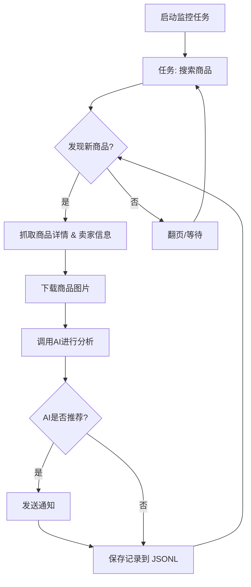

# 闲鱼智能监控机器人

一个基于 Playwright 和AI过滤分析的闲鱼多任务实时监控与智能分析工具，配备了功能完善的 Web 管理界面。

## ✨ 项目亮点

- **可视化Web界面**: 提供完整的Web UI，支持任务的可视化管理、AI标准在线编辑、运行日志实时查看和结果筛选浏览，无需直接操作命令行和配置文件。
- **AI驱动的任务创建**: 只需用自然语言描述你的购买需求，即可一键创建包含复杂筛选逻辑的全新监控任务。
- **多任务并发**: 通过 `config.json` 同时监控多个关键词，各任务独立运行，互不干扰。
- **实时流式处理**: 发现新商品后，立即进入分析流程，告别批处理延迟。
- **深度AI分析**: 集成多模态大语言模型（如 GPT-4o），结合商品图文和卖家画像进行深度分析，精准筛选。
- **高度可定制**: 每个监控任务均可配置独立的关键词、价格范围、筛选条件和AI分析指令 (Prompt)。
- **即时通知**: 支持通过 [ntfy.sh](https://ntfy.sh/) 和企业微信机器人，将符合AI推荐的商品立即推送到你的手机或桌面。
- **定时任务调度**: 支持 Cron 表达式，可为每个任务设置独立的定时执行计划。
- **Docker 一键部署**: 提供 `docker-compose` 配置，实现快速、标准化的容器化部署。
- **健壮的反爬策略**: 模拟真人操作，包含多种随机延迟和用户行为，提高稳定性。

## 页面截图

**后台任务管理**


**后台监控截图**


**ntf通知截图**


## 🚀 快速开始 (Web UI 推荐)

推荐使用 Web 管理界面来操作本项目，体验最佳。

### 第 1 步: 环境准备

克隆本项目到本地:

```bash
git clone https://github.com/dingyufei615/ai-goofish-monitor
cd ai-goofish-monitor
```

安装所需的Python依赖：

```bash
pip install -r requirements.txt
```

### 第 2 步: 基础配置

1. **配置环境变量**: 复制`.env.example`文件并命名为`.env`，并修改里面的内容。
Windows使用命令行：

    ```cmd
    copy .env.example .env
    ```

    Linux/MacOS使用命令行：

    ```shell
    cp .env.example .env
    ```

2. **获取登录状态 (重要!)**: 为了让爬虫能够以登录状态访问闲鱼，**必须先运行一次登录脚本**以生成会话状态文件。

    ```bash
    python login.py
    ```

    运行后会弹出一个浏览器窗口，请使用**手机闲鱼App扫描二维码**完成登录。成 后，程序会自动关闭，并在项目根目录生成一个 `xianyu_state.json` 文件。

### 第 3 步: 启动 Web 服务

一切就绪后，启动 Web 管理后台服务器。

```bash
python web_server.py
```

### 第 4 步: 开始使用

在浏览器中打开 `http://127.0.0.1:8000` 访问管理后台。

1. 在 **“任务管理”** 页面，点击 **“创建新任务”**。
2. 在弹出的窗口中，用自然语言描述你的购买需求（例如：“我想买一台95新以上的索尼A7M4相机，预算1万3以内，快门数低于5000”），并填写任务名称、关键词等信息。
3. 点击创建，AI将自动为你生成一套复杂的分析标准。
4. 回到主界面，点击右上角的 **“🚀 全部启动”**，开始享受自动化监控！

## 🐳 Docker 部署 (推荐)

使用 Docker 可以将应用及其所有依赖项打包到一个标准化的单元中，实现快速、可靠和一致的部署。

### 第 1 步: 环境准备 (与本地部署类似)

1. **安装 Docker**: 请确保你的系统已安装 [Docker Engine](https://docs.docker.com/engine/install/)。

2. **克隆项目并配置**:

    ```bash
    git clone https://github.com/dingyufei615/ai-goofish-monitor
    cd ai-goofish-monitor
    ```

3. **创建 `.env` 文件**: 参考 **[快速开始](#-快速开始-web-ui-推荐)** 部分的说明，在项目根目录创建并填写 `.env` 文件。

4. **获取登录状态 (关键步骤!)**: **在宿主机上 (非 Docker 内)** 运行登录脚本，以生成 `xianyu_state.json` 文件。这是因为登录过程需要人工交互（扫码），无法在 Docker 构建过程中完成。

    ```bash
    # 确保你本地有 python 环境并已安装依赖
    pip install -r requirements.txt
    python login.py 
    ```

    扫码登录成功后，项目根目录会生成 `xianyu_state.json` 文件。

### 第 2 步: 运行 Docker 容器

项目已包含 `docker-compose.yaml` 文件，我们推荐使用 `docker-compose` 来管理容器，这比使用 `docker run` 更方便。

在项目根目录下，运行以下命令来启动容器：

```bash
docker-compose up -d
```

这会以后台模式启动服务。`docker-compose` 会自动读取 `.env` 文件和 `docker-compose.yaml` 的配置，并根据其内容来创建和启动容器。

如果容器内遇到网络问题，请自行排查或使用代理。

### 第 3 步: 访问和管理

- **访问 Web UI**: 在浏览器中打开 `http://127.0.0.1:8000`。
- **查看实时日志**: `docker-compose logs -f`
- **停止容器**: `docker-compose stop`
- **启动已停止的容器**: `docker-compose start`
- **停止并移除容器**: `docker-compose down`

## 📸 Web UI 功能一览

- **任务管理**:
  - **AI创建任务**: 使用自然语言描述需求，一键生成监控任务和配套AI分析标准。
  - **可视化编辑与控制**: 在表格中直接修改任务参数（如关键词、价格、定时规则等），并能独立启/停、删除每个任务。
  - **定时调度**: 为任务配置 Cron 表达式，实现自动化周期性运行。
- **结果查看**:
  - **卡片式浏览**: 以图文卡片形式清晰展示每个符合条件的商品。
  - **智能筛选与排序**: 可一键筛选出所有被AI标记为“推荐”的商品，并支持按爬取时间、发布时间、价格等多种方式排序。
  - **深度详情**: 点击即可查看每个商品的完整抓取数据和AI分析的详细JSON结果。
- **运行日志**:
  - **实时日志流**: 在网页上实时查看爬虫运行的详细日志，方便追踪进度和排查问题。
  - **日志管理**: 支持自动刷新、手动刷新和一键清空日志。
- **系统设置**:
  - **状态检查**: 一键检查 `.env` 配置、登录状态等关键依赖是否正常。
  - **Prompt在线编辑**: 直接在网页上编辑和保存用于AI分析的 `prompt` 文件，实时调整AI的思考逻辑。

## ⚙️ 命令行高级用法

对于喜欢命令行的用户，项目同样保留了脚本独立运行的能力。

### 启动监控

直接运行主爬虫脚本，它会加载 `config.json` 中所有启用的任务。

```bash
python spider_v2.py
```

**调试模式**: 如果只想测试少量商品，可以使用 `--debug-limit` 参数。

```bash
# 每个任务只处理前2个新发现的商品
python spider_v2.py --debug-limit 2
```

### 通过脚本创建新任务

`prompt_generator.py` 脚本可以让你通过命令行快速创建新任务。

```bash
python prompt_generator.py \
  --description "我想买一台95新以上的索尼A7M4相机，预算在10000到13000元之间，快门数要低于5000。必须是国行且配件齐全。优先考虑个人卖家，不接受商家或贩子。" \
  --output prompts/sony_a7m4_criteria.txt \
  --task-name "Sony A7M4" \
  --keyword "a7m4" \
  --min-price "10000" \
  --max-price "13000"
```

执行后，它会自动创建新的 `_criteria.txt` 文件，并在 `config.json` 中添加并启用对应的新任务。

## 🚀 工作流程

下图描述了单个监控任务从启动到完成的核心处理逻辑。在实际使用中，`web_server.py` 会作为主服务，根据用户操作或定时调度来启动一个或多个这样的任务进程。



## 🛠️ 技术栈

- **核心框架**: Playwright (异步) + asyncio
- **Web服务**: FastAPI
- **任务调度**: APScheduler
- **AI 模型**: OpenAI API (支持 GPT-4o 等多模态模型)
- **通知服务**: ntfy, 企业微信机器人
- **配置管理**: JSON
- **依赖管理**: pip

## 📂 项目结构

```
.
├── .env                # 环境变量，存放API密钥等敏感信息
├── .gitignore          # Git忽略配置
├── config.json         # 核心配置文件，定义所有监控任务 (主要通过Web UI管理)
├── login.py            # 首次运行必须执行，用于获取并保存登录Cookie
├── spider_v2.py        # 核心爬虫程序 (由Web服务按需启动)
├── prompt_generator.py # AI分析标准生成脚本 (功能已集成到Web UI)
├── web_server.py       # Web服务主程序，提供API和Web UI
├── requirements.txt    # Python依赖库
├── README.md           # 就是你正在看的这个文件
├── prompts/            # 存放不同任务的AI分析指令(Prompt)
│   ├── base_prompt.txt
│   └── ..._criteria.txt
├── static/             # Web前端静态文件
│   ├── css/style.css
│   └── js/main.js
├── templates/          # Web前端模板
│   └── index.html
├── images/             # (自动创建) 存放下载的商品图片
├── logs/               # (自动创建) 存放运行日志
└── jsonl/              # (自动创建) 存放每个任务的抓取和分析结果
```

## 常见问题 (FAQ)

这里整理了一些社区用户在 Issues 中提出的常见问题及其解答。

1. **Q: 运行 `login.py` 或 `spider_v2.py` 时出现 `'gbk' codec can't encode character` 相关的编码错误？**
    - **A:** 这是典型的 Windows 环境下的编码问题。项目代码和日志默认使用 UTF-8 编码。
    - **解决方案:** 在运行 Python 脚本前，通过设置环境变量强制使用 UTF-8。在 PowerShell 或 CMD 中执行以下命令，然后再运行脚本：

        ```bash
        set PYTHONUTF8=1
        python spider_v2.py
        ```

        或者使用 `chcp 65001` 命令切换活动代码页为 UTF-8。

2. **Q: 运行 `login.py` 时提示需要 `playwright install` 怎么办？**
    - **A:** 这个错误表示 Playwright 运行所需的浏览器文件缺失。推荐的解决方法是，确保所有依赖都已通过 `requirements.txt` 正确安装。请在命令行中运行：

        ```bash
        pip install -r requirements.txt
        ```

        如果问题依旧，可以尝试手动安装 chromium 浏览器：

        ```bash
        playwright install chromium
        ```

3. **Q: 创建任务或运行时，提示 "Request timed out" 或 "Connection error" 是什么原因？**
    - **A:** 这通常是网络问题，表示你的服务器无法连接到 `.env` 文件中配置的 `OPENAI_BASE_URL`。请检查：
        - 你的服务器网络是否通畅。
        - 如果你在中国大陆，访问国外 AI 服务（如 OpenAI, Gemini）可能需要设置网络代理。现在你可以直接在 `.env` 文件中配置 `PROXY_URL` 变量来解决此问题。
        - 确认 `OPENAI_BASE_URL` 地址填写正确，并且该服务正在正常运行。

4. **Q: 我选择的 AI 模型不支持图片分析怎么办？**
    - **A:** 本项目的核心优势之一是结合图片进行多模态分析，因此 **必须** 选择一个支持图片识别（Vision / Multi-modal）的 AI 模型。如果你配置的模型不支持图片，AI 分析会失败或效果大打折扣。请在 `.env` 文件中将 `OPENAI_MODEL_NAME` 更换为支持图片输入的模型，例如 `gpt-4o`, `gemini-1.5-pro`, `deepseek-v2`, `qwen-vl-plus` 等。

5. **Q: 我可以在群晖 (Synology) NAS 上通过 Docker 部署吗？**
    - **A:** 可以。部署步骤与标准的 Docker 部署基本一致：
        1. 在你的电脑上（而不是群晖上）完成 `login.py` 步骤，生成 `xianyu_state.json` 文件。
        2. 将整个项目文件夹（包含 `.env` 和 `xianyu_state.json`）上传到群晖的某个目录下。
        3. 在群晖的 Container Manager (或旧版 Docker) 中，使用 `docker-compose up -d` 命令（通过 SSH 或任务计划）来启动项目。确保 `docker-compose.yaml` 中的 volume 映射路径正确指向你在群晖上的项目文件夹。

6  **Q: 如何配置使用 Gemini / Qwen / Grok 或其他非 OpenAI 的大语言模型？**
    ***A:** 本项目理论上支持任何提供 OpenAI 兼容 API 接口的模型。关键在于正确配置 `.env` 文件中的三个变量：
        *   `OPENAI_API_KEY`: 你的模型服务商提供的 API Key。
        *`OPENAI_BASE_URL`: 模型服务商提供的 API-Compatible Endpoint 地址。请务必查阅你所使用模型的官方文档，通常格式为 `https://api.your-provider.com/v1` (注意，末尾不需要 `/chat/completions`)。
        *   `OPENAI_MODEL_NAME`: 你要使用的具体模型名称，需要模型支持图片识别，例如 `gemini-2.5-flash`。
    *   **示例:** 如果你的服务商文档说 Completions 接口是 `https://xx.xx.com/v1/chat/completions`，那么 `OPENAI_BASE_URL` 就应该填 `https://xx.xx.com/v1`。

7  **Q: 运行一段时间后被闲鱼检测到，提示“异常流量”或需要滑动验证？**
    ***A:** 这是闲鱼的反爬虫机制。为了降低被检测的风险，可以尝试以下方法：
        *   **关闭无头模式:** 在 `.env` 文件中设置 `RUN_HEADLESS=false`。这样浏览器会以有界面的方式运行，当出现滑动验证码时，你可以手动完成验证，程序会继续执行。
        ***降低监控频率:** 避免同时运行大量监控任务。
        *   **使用干净的网络环境:** 频繁爬取可能导致 IP 被临时标记。

## 致谢

本项目在开发过程中参考了以下优秀项目，特此感谢：

- [superboyyy/xianyu_spider](https://github.com/superboyyy/xianyu_spider)

以及感谢LinuxDo相关佬友的脚本贡献

- [@jooooody](https://linux.do/u/jooooody/summary)

以及感谢Aider和Gemini 解放双手，代码写起来飞一般的感觉～

## ⚠️ 注意事项

- 请遵守闲鱼的用户协议和robots.txt规则，不要进行过于频繁的请求，以免对服务器造成负担或导致账号被限制。
- 本项目仅供学习和技术研究使用，请勿用于非法用途。

[](https://star-history.com/#dingyufei615/ai-goofish-monitor&Date)
