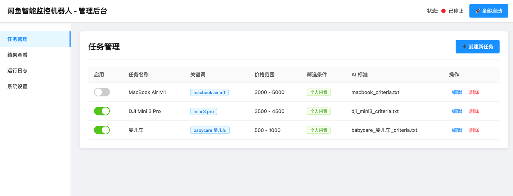
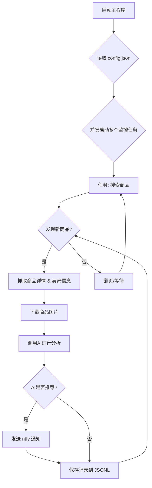

# 闲鱼智能监控机器人

一个基于 Playwright 和AI过滤分析的闲鱼多任务实时监控与智能分析工具，配备了功能完善的 Web 管理界面。

## ✨ 项目亮点

- **可视化Web界面**: 提供完整的Web UI，支持任务的可视化管理、AI标准在线编辑、运行日志实时查看和结果筛选浏览，无需直接操作命令行和配置文件。
- **AI驱动的任务创建**: 只需用自然语言描述你的购买需求，即可一键创建包含复杂筛选逻辑的全新监控任务。
- **多任务并发**: 通过 `config.json` 同时监控多个关键词，各任务独立运行，互不干扰。
- **实时流式处理**: 发现新商品后，立即进入分析流程，告别批处理延迟。
- **深度AI分析**: 集成多模态大语言模型（如 GPT-4o），结合商品图文和卖家画像进行深度分析，精准筛选。
- **高度可定制**: 每个监控任务均可配置独立的关键词、价格范围、筛选条件和AI分析指令 (Prompt)。
- **即时通知**: 通过 [ntfy.sh](https://ntfy.sh/) 将符合AI推荐的商品立即推送到你的手机或桌面。
- **健壮的反爬策略**: 模拟真人操作，包含多种随机延迟和用户行为，提高稳定性。

## 页面截图
后台任务管理


后台监控截图


ntf通知截图


## 🚀 快速开始 (Web UI 推荐)

推荐使用 Web 管理界面来操作本项目，体验最佳。

### 第 1 步: 环境准备

克隆本项目到本地:
```bash
git clone https://github.com/dingyufei615/ai-goofish-monitor
cd ai-goofish-monitor
```

安装所需的Python依赖：
```bash
pip install -r requirements.txt
```

### 第 2 步: 基础配置

1.  **配置环境变量**: 在项目根目录创建一个 `.env` 文件，并填入以下配置信息。
    ```env
    # --- AI 模型相关配置 ---
    # 模型的API Key。
    OPENAI_API_KEY="sk-..."
    
    # 模型的API接口地址。这里需要填写服务商提供的、兼容OpenAI格式的API地址，基本所有模型都有提供OpenAI格式兼容的接口
    # 可查阅你使用的大模型API文档，如格式为 https://xx.xx.com/v1/chat/completions 则OPENAI_BASE_URL只需要填入前半段 https://xx.xx.com/v1/
    OPENAI_BASE_URL="https://generativelanguage.googleapis.com/v1beta/openai/"
    
    # 使用的模型名称，模型需要支持图片上传。
    OPENAI_MODEL_NAME="gemini-2.5-pro"

    # ntfy 通知服务配置
    NTFY_TOPIC_URL="https://ntfy.sh/your-topic-name" # 替换为你的 ntfy 主题 URL
    
    # 企业微信机器人通知配置 如果无则不用配置
    WX_BOT_URL="https://qyapi.weixin.qq.com/cgi-bin/webhook/send?key=xxxxx"

    # 是否使用edge浏览器 默认使用chrome浏览器
    LOGIN_IS_EDGE=false
    
    # 是否开启电脑链接转换为手机链接
    PCURL_TO_MOBILE=true
    
    # 爬虫是否以无头模式运行 (true/false)。遇到滑动验证码时，可设为 false 
    RUN_HEADLESS=true
    ```

2.  **获取登录状态 (重要!)**: 为了让爬虫能够以登录状态访问闲鱼，**必须先运行一次登录脚本**以生成会话状态文件。
    ```bash
    python login.py
    ```
    运行后会弹出一个浏览器窗口，请使用**手机闲鱼App扫描二维码**完成登录。成功后，程序会自动关闭，并在项目根目录生成一个 `xianyu_state.json` 文件。

### 第 3 步: 启动 Web 服务

一切就绪后，启动 Web 管理后台服务器。
```bash
python web_server.py
```

### 第 4 步: 开始使用

在浏览器中打开 `http://127.0.0.1:8000` 访问管理后台。

1.  在 **“任务管理”** 页面，点击 **“创建新任务”**。
2.  在弹出的窗口中，用自然语言描述你的购买需求（例如：“我想买一台95新以上的索尼A7M4相机，预算1万3以内，快门数低于5000”），并填写任务名称、关键词等信息。
3.  点击创建，AI将自动为你生成一套复杂的分析标准。
4.  回到主界面，点击右上角的 **“🚀 全部启动”**，开始享受自动化监控！

## 📸 Web UI 功能一览

-   **任务管理**:
    -   **AI创建任务**: 使用自然语言描述需求，一键生成监控任务和配套AI分析标准。
    -   **可视化编辑**: 在表格中直接修改任务参数，如关键词、价格范围等。
    -   **启停控制**: 独立控制每个任务的启用/禁用状态，或一键启停所有任务。
-   **结果查看**:
    -   **卡片式浏览**: 以图文卡片形式清晰展示每个符合条件的商品。
    -   **智能筛选**: 可一键筛选出所有被AI标记为“推荐”的商品。
    -   **深度详情**: 查看每个商品的完整抓取数据和AI分析的详细JSON结果。
-   **运行日志**:
    -   **实时日志流**: 在网页上实时查看爬虫运行的详细日志，方便追踪进度和排查问题。
-   **系统设置**:
    -   **状态检查**: 一键检查 `.env` 配置、登录状态等关键依赖是否正常。
    -   **Prompt在线编辑**: 直接在网页上编辑和保存用于AI分析的 `prompt` 文件，实时调整AI的思考逻辑。

## ⚙️ 命令行高级用法

对于喜欢命令行的用户，项目同样保留了脚本独立运行的能力。

### 启动监控

直接运行主爬虫脚本，它会加载 `config.json` 中所有启用的任务。
```bash
python spider_v2.py
```
**调试模式**: 如果只想测试少量商品，可以使用 `--debug-limit` 参数。
```bash
# 每个任务只处理前2个新发现的商品
python spider_v2.py --debug-limit 2
```

### 通过脚本创建新任务

`prompt_generator.py` 脚本可以让你通过命令行快速创建新任务。
```bash
python prompt_generator.py \
  --description "我想买一台95新以上的索尼A7M4相机，预算在10000到13000元之间，快门数要低于5000。必须是国行且配件齐全。优先考虑个人卖家，不接受商家或贩子。" \
  --output prompts/sony_a7m4_criteria.txt \
  --task-name "Sony A7M4" \
  --keyword "a7m4" \
  --min-price "10000" \
  --max-price "13000"
```
执行后，它会自动创建新的 `_criteria.txt` 文件，并在 `config.json` 中添加并启用对应的新任务。

## 🚀 工作流程



## 🛠️ 技术栈

- **核心框架**: Playwright (异步) + asyncio
- **Web服务**: FastAPI
- **AI 模型**: OpenAI API (支持 GPT-4o 等多模态模型)
- **通知服务**: ntfy
- **配置管理**: JSON
- **依赖管理**: pip

## 📂 项目结构

```
.
├── .env                # 环境变量，存放API密钥等敏感信息
├── .gitignore          # Git忽略配置
├── config.json         # 核心配置文件，用于定义所有监控任务
├── login.py            # 首次运行必须执行，用于获取并保存登录Cookie
├── spider_v2.py        # 核心爬虫程序
├── prompt_generator.py # AI分析标准生成脚本
├── web_server.py       # Web服务主程序
├── requirements.txt    # Python依赖库
├── README.md           # 就是你正在看的这个文件
├── prompts/            # 存放不同任务的AI分析指令(Prompt)
│   ├── base_prompt.txt
│   └── ..._criteria.txt
├── static/             # Web前端静态文件
│   ├── css/style.css
│   └── js/main.js
├── templates/          # Web前端模板
│   └── index.html
├── images/             # (自动创建) 存放下载的商品图片
├── logs/               # (自动创建) 存放运行日志
└── *.jsonl             # (自动创建) 存放每个任务的抓取和分析结果
```

## 致谢

本项目在开发过程中参考了以下优秀项目，特此感谢：
- [superboyyy/xianyu_spider](https://github.com/superboyyy/xianyu_spider)

以及感谢LinuxDo相关佬友的脚本贡献
- [@jooooody](https://linux.do/u/jooooody/summary)

以及感谢Aider和Gemini 解放双手，代码写起来飞一般的感觉～

## ⚠️ 注意事项

- 请遵守闲鱼的用户协议和robots.txt规则，不要进行过于频繁的请求，以免对服务器造成负担或导致账号被限制。
- 本项目仅供学习和技术研究使用，请勿用于非法用途。

[](https://star-history.com/#dingyufei615/ai-goofish-monitor&Date)
